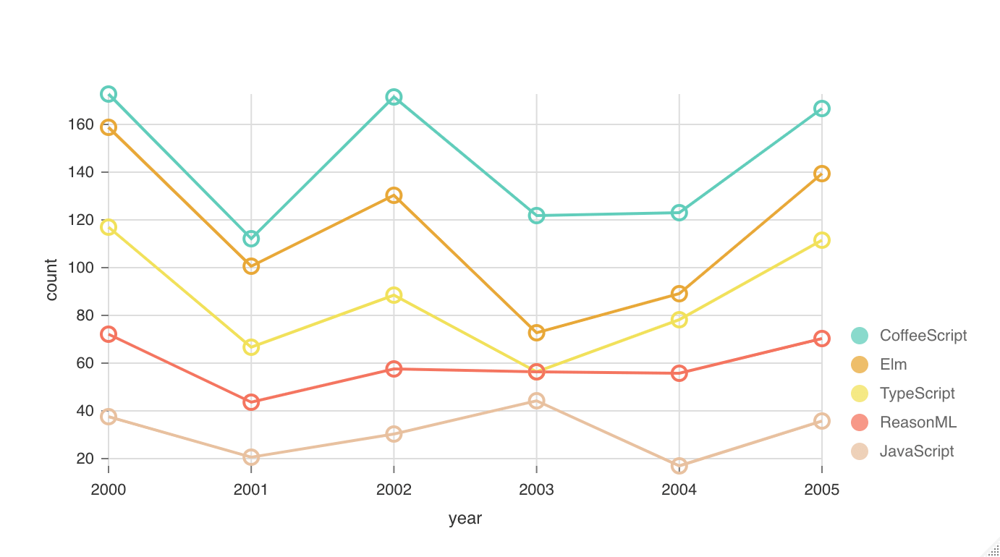
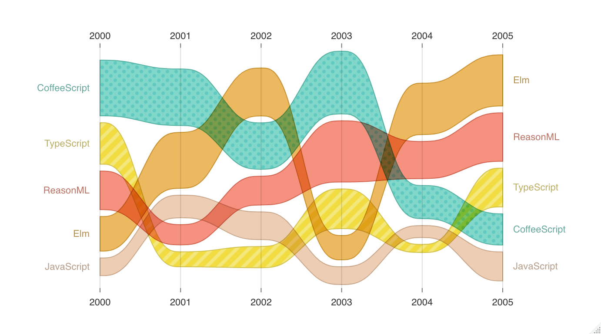
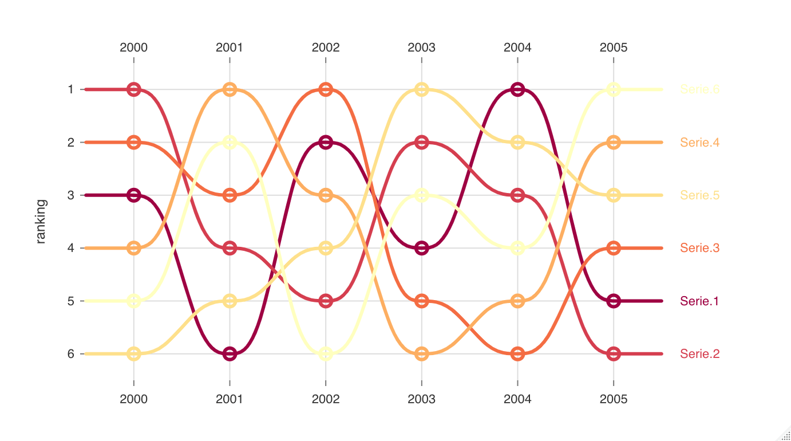

<!-- README.md is generated from README.Rmd. Please edit that file -->

# nivor

<!-- badges: start -->

[](https://CRAN.R-project.org/package=nivor)
[](https://codecov.io/gh/swsoyee/nivor?branch=main)
[](https://github.com/swsoyee/nivor/actions)
[](https://www.tidyverse.org/lifecycle/#experimental)
<!-- badges: end -->

The goal of nivor is to …

## Installation

You can install the released version of nivor from
[CRAN](https://CRAN.R-project.org) with:

``` r
install.packages("nivor")
```

## Example

This is a basic example which shows you how to solve a common problem:

``` r
library(nivor)
```

### Scatter

``` r
n_scatter(
  data = iris,
  x = "Sepal.Width",
  y = "Sepal.Length",
  group = "Species"
)
```


### Line

``` r
data <- data.frame(
  year = 2000:2005,
  JavaScript = runif(6, min = 0, max = 50),
  ReasonML = runif(6, min = 0, max = 50),
  TypeScript = runif(6, min = 0, max = 50),
  Elm = runif(6, min = 0, max = 50),
  CoffeeScript = runif(6, min = 0, max = 50)
)

n_line(data)
```



### AreaBump

``` r
n_area_bump(data)
```



### Bump

``` r
data <- data.frame(
  group = 2000:2005,
  "Serie 1" = c(3, 6, 2, 4, 1, 5),
  "Serie 2" = c(1, 4, 5, 2, 3, 6),
  "Serie 3" = c(2, 3, 1, 5, 6, 4),
  "Serie 4" = c(4, 1, 3, 6, 5, 2),
  "Serie 5" = c(6, 5, 4, 1, 2, 3),
  "Serie 6" = c(5, 2, 6, 3, 4, 1)
)

n_bump(data)
```



### Calendar

``` r
df <- data.frame(
  day = seq.Date(
    from = as.Date("2020-04-01"),
    length.out = 600,
    by = "days"
  ),
  value = round(runif(600) * 1000, 0)
)

n_calendar(df)
```


## Code of Conduct

Please note that the nivor project is released with a [Contributor Code
of
Conduct](https://contributor-covenant.org/version/2/0/CODE_OF_CONDUCT.html).
By contributing to this project, you agree to abide by its terms.
